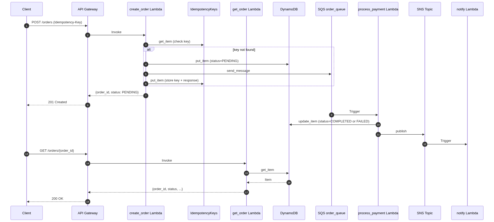

# AWS Serverless Order/Payment Pipeline


A minimal, free-tier-friendly event-driven backend that demonstrates how an e-commerce order pipeline works: receive an order, store it, queue it for async payment processing, update the status, and notify.

Built with **Python** and **Terraform** on the **AWS Free Plan** in `ap-south-1`.

## Architecture

```
POST /orders                GET /orders/{order_id}
  |                              |
  +------------------------------+
                 |
                 v
       API Gateway (HTTP API v2)
                 |
       +---------+---------+
       v                   v
create_order Lambda    get_order Lambda
  |                         |
  |                         v
  |                   DynamoDB (orders)
  |
  v
DynamoDB      SQS (order_queue)
(orders)           |
                   v
          process_payment Lambda
                   |
         +---------+---------+
         v                   v
  DynamoDB update       SNS topic
  (status)                |
                          v
                  notify Lambda (logs)
```

## End-to-end flow



The Mermaid source for this diagram is in `docs/e2e-flow.mmd` and can be opened in [Mermaid Live Editor](https://mermaid.live).

## Services used

- API Gateway HTTP API v2
- AWS Lambda (Python 3.12)
- DynamoDB
- SQS with Dead-Letter Queue
- SNS
- CloudWatch Logs (7-day retention)

## Prerequisites

1. AWS Free Plan account with IAM admin user and AWS CLI configured.
2. Terraform >= 1.5
3. Python 3.11+ (only for local testing)
4. `ap-south-1` as default region

## Project layout

```
.
├── Makefile
├── docs/
│   ├── e2e-flow.mmd
│   └── e2e-flow.png
├── payload.json
├── payload_fail.json
├── requirements.txt
├── src/
│   ├── create_order.py
│   ├── get_order.py
│   ├── process_payment.py
│   └── notify.py
├── tests/
│   ├── test_create_order.py
│   └── test_get_order.py
└── terraform/
    ├── main.tf
    ├── variables.tf
    └── outputs.tf
```

## Deploy

```bash
make init    # terraform init + create build dir
make plan    # terraform plan
make deploy  # terraform apply -auto-approve
```

## Local testing

Run the unit tests before deploying:

```bash
pip install -r requirements.txt
python -m pytest tests/ -v
```

## CI/CD

Every push and pull request to `main` runs the GitHub Actions workflow in `.github/workflows/ci.yml`:

- **Python tests** with `pytest`
- **Terraform format check** with `terraform fmt -check`
- **Terraform validation** with `terraform validate`

This ensures that code and infrastructure changes are tested before they reach `main`.

## Test on AWS

After deploy, get the API endpoint:

```bash
terraform -chdir=terraform output -raw api_endpoint
```

Place an order:

```bash
curl -X POST $(terraform -chdir=terraform output -raw api_endpoint) \
  -H "Content-Type: application/json" \
  -H "Idempotency-Key: $(uuidgen)" \
  -d @payload.json
```

Expected response:

```json
{"order_id": "...", "status": "PENDING"}
```

The `Idempotency-Key` header prevents duplicate orders when the request is retried. Sending the same key twice returns the same order.

To see the failure path (amount > 1000 is rejected):

```bash
curl -X POST $(terraform -chdir=terraform output -raw api_endpoint) \
  -H "Content-Type: application/json" \
  -H "Idempotency-Key: $(uuidgen)" \
  -d @payload_fail.json
```

Check the DynamoDB table in the console to see the order move from `PENDING` to `COMPLETED` or `FAILED`.

### Fetch an order by id

Save the returned `order_id` and fetch the current status:

```bash
ORDER_ID=e54565f3-4040-4a15-a152-3c7366434ba8
curl -X GET $(terraform -chdir=terraform output -raw api_endpoint)/$ORDER_ID
```

Expected response after payment processing:

```json
{
  "order_id": "...",
  "product_id": "prod-123",
  "customer_id": "cust-456",
  "quantity": 2,
  "amount": "49.99",
  "status": "COMPLETED"
}
```

## Destroy

```bash
make destroy
```

This removes all AWS resources and stops any charges.

## Free tier notes

- Keep traffic low to stay within the AWS Free Tier and credits.
- No long-running servers (EC2/RDS/NAT Gateway) are created, so idle cost is $0.
- DynamoDB is set to on-demand for simplicity. If you want to guarantee zero request charges, switch to provisioned mode in `terraform/main.tf`.

## What to say in an interview

- "I built an event-driven order pipeline with API Gateway, Lambda, DynamoDB, SQS, and SNS."
- "It has both a `POST /orders` endpoint to create orders and a `GET /orders/{order_id}` endpoint to fetch order status."
- "I implemented idempotency using an `Idempotency-Key` header and a DynamoDB TTL table, so retries never create duplicate orders."
- "I used Terraform so the entire infrastructure is version-controlled and repeatable."
- "I set up GitHub Actions CI/CD to run Python tests and Terraform validation on every pull request."
- "I used a Dead-Letter Queue for failed payment processing and CloudWatch for observability."
- "It stays inside the AWS Free Tier, so it costs almost nothing to run."
